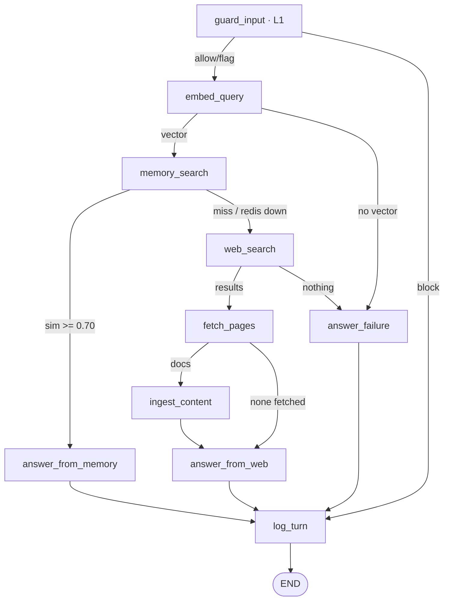

# Code Walkthrough — Following a Question Through the Repo

> **Private working doc.** Git-excluded via `.git/info/exclude` — **never committed or pushed**; lives only on this machine. Companion to `INTERVIEW_GUIDE.md`.
> Repo: `main` @ `b6d079b` · **428 tests** · **232 BDD scenarios** in 45 feature files · **152/152** functions AST-gated. All symbols below verified against the code at this SHA.

**How to read this.** We follow one real question, `memagent ask "How does Redis 8 vector search work?"`, through the code in call order. Each step is **file · symbol · what fires · the BDD scenario that pins it**. Two journeys cover the spine — a cold **miss** (touches every file) and the **hit** replay (the short path) — then the three degraded routes, the security layers, and how BDD nails it all down.

The whole run is **one compiled async `StateGraph`** (`graph.py`), 10 nodes, all branching in **5 pure router functions** (`routers.py`). The hit/miss call — *"do we already know this?"* — is `sim >= 0.70` in **code**, never a model. That is the one thing to see first: open `routers.py:18` (`route_after_memory`).

**Node → file → covering feature** (the "which file first" index):

| # | Graph node | File | Fires | Covered by |
|---|---|---|---|---|
| — | entry | `cli.py` → `app.py` | Typer `ask` → `_stream_turn` → `graph.astream` | `cli.feature`, `app.feature` |
| 1 | `guard_input` | `nodes/guard.py` → `security/guardrails.py` | L1 screen | `nodes_guard.feature` |
| 2 | `embed_query` | `nodes/embed.py` | embed sanitized query | `nodes_embed.feature` |
| 3 | `memory_search` | `nodes/memory.py` → `memory/store.py` | raw KNN top-5 | `nodes_memory.feature` |
| 4 | `web_search` | `nodes/search.py` → `web/search.py` | Tavily→ddgs | `nodes_search.feature` |
| 5 | `fetch_pages` | `nodes/fetch.py` → `web/fetch.py` | SSRF filter + fetch | `nodes_fetch.feature` |
| 6 | `ingest_content` | `nodes/ingest.py` → `security/sanitizer.py`, `memory/chunking.py`, `memory/store.py` | sanitize→chunk→store | `nodes_ingest.feature` |
| 7 | `answer_from_memory` / `answer_from_web` / `answer_failure` | `nodes/answer.py` → `llm/prompts.py` | grounded answer | `nodes_answer.feature` |
| 8 | `log_turn` | `nodes/log.py` → `analytics/turnlog.py`, `analytics/classify.py` | one JSONL record | `nodes_log.feature` |
| ⇄ | 5 routers | `routers.py` | every branch | `routers.feature` |

Every terminal route is pinned end-to-end by one scenario in `tests/bdd/features/00_main_functionality.feature` (`# covers-route:`), then re-pinned per function in the per-module files.

---

## Journey 1 — a cold question → `memory_miss_web_search` (the full pipeline)

*Root scenario: "Fall back to the web and ingest what was found on a memory miss".*

**0 · Entry.** `src/memagent/__main__.py` → `cli.app()` (Typer). `cli.ask()` loads `Settings`, exits 1 if `OPENAI_API_KEY` is unset, then `asyncio.run(_ask(...))`. `_ask` builds the `Agent` (DI via `app.build_resources()` — one shared OpenAI transport, `RedisMemoryStore`, `FallbackProvider`, `HttpxPageFetcher`, `TurnLogger` in a frozen `AgentResources`), seeds `new_turn_state`, awaits `ensure_ready` (provisions the index once), and drives **one** turn through `_stream_turn → agent.graph.astream(stream_mode="updates")` under a stderr spinner. *(The programmatic twin `Agent.answer` in `app.py` uses `graph.ainvoke` instead — same graph, same H3 seed.)* · *covers:* `cli.feature`, `app.feature`, `graph.feature`

**1 · `guard_input`** — `nodes/guard.py` wraps the pure `screen_input()` in `security/guardrails.py`. NFKC-normalize → strip zero-width → **length-cap** → scan `PATTERN_REGISTRY` (`security/patterns.py`), folding severities: HIGH→`block`, MEDIUM→`flag` (proceed but `skip_store`), else `allow`. Writes `guard_verdict` + `sanitized_query`. **Fails open** (any exception → `allow`). → `routers.route_after_guard`: `block` jumps straight to `log_turn`; else `embed_query`. · *covers:* `nodes_guard.feature` — *"Malicious input is refused at the guard with a canned message"*

**2 · `embed_query`** — `nodes/embed.py` embeds **`sanitized_query`** (not the raw query) via `resources.embedder.embed` → `query_vector`. Self-degrades to `None` on failure. → `route_after_embed`: no vector → `answer_failure`, else `memory_search`. · *covers:* `nodes_embed.feature`

**3 · `memory_search`** — `nodes/memory.py` calls `RedisMemoryStore.knn` (`memory/store.py`): a `VectorQuery` (FLAT/cosine/1536, `num_results=5`) returns the **raw** top-k. `distance_to_similarity()` (`store.py:70`, the **one** `1 − distance` site) attaches `similarity`; `top_similarity = hits[0].similarity`. **No threshold here.** Catches only `MemoryUnavailableError` → treats as a miss + `degradation="redis_down"`. → `route_after_memory` (`routers.py:18`): `sim is not None and sim >= threshold` → `answer_from_memory`, else `web_search`. Cold memory ⇒ **miss**. · *covers:* `nodes_memory.feature` — *"The raw top-k is returned unfiltered…"*, `memory_store.feature` — *"A cosine distance becomes a similarity by one minus the distance"*

**4 · `web_search`** — `nodes/search.py` calls `FallbackProvider.search` (`web/search.py`): **Tavily** first iff a key is present (retried at the single POST site, 4xx re-raises), then the **keyless ddgs** leg on any failure — bounded by an `asyncio.wait_for` deadline + 2-attempt retry. Writes `search_results` + `search_provider`. → `route_after_search`: empty → `answer_failure`, else `fetch_pages`. · *covers:* `nodes_search.feature`, `web_search.feature` — *"When Tavily rejects the key the provider degrades to the keyless fallback"*

**5 · `fetch_pages`** — `nodes/fetch.py` runs `filter_urls` then `HttpxPageFetcher.fetch` (`web/fetch.py`): an **SSRF + per-domain diversity filter** (`_is_private_host` rejects private/loopback/link-local **+ CGNAT `100.64.0.0/10` + multicast**), then a semaphore-bounded, deadline-wrapped per-URL fetch that **re-checks SSRF on every redirect hop**, enforces a size cap + content-type, and offloads `trafilatura` → markdown. All-fail → empty `fetched_docs`. → `route_after_fetch`: empty → `answer_from_web` (snippets path), else `ingest_content`. · *covers:* `nodes_fetch.feature`, `web_fetch.feature` — *"A hostname resolving to a private IP is flagged private"*

**6 · `ingest_content`** — `nodes/ingest.py`, per doc **concurrently** (`asyncio.gather` behind the fetch semaphore): `sanitize()` (**L3**, `security/sanitizer.py`) → `is_fresh` check → summarize (bounded input, own `asyncio.wait_for` deadline + `summary_retry`) → **re-sanitize the summary** and merge flags → `chunk_markdown` (`memory/chunking.py`: ~1600/200 overlap, 100-char floor, 25-chunk cap) → embed → `RedisMemoryStore.store` (**one pipeline**, TTL'd). Chunking always runs; **persistence never gates answering** (fresh / `skip_store` / store-fail all still hand the in-hand chunks downstream). → edge to `answer_from_web`. · *covers:* `nodes_ingest.feature` — *"A fetched page is sanitized, summarised, chunked and stored for future reuse"*, `memory_chunking.feature`, `security_sanitizer.feature`

**7 · `answer_from_web`** — `nodes/answer.py`. Builds **bounded** per-page context (summary + first **2** chunks) → `wrap_context` (**L2**, `llm/prompts.py`: content fenced as quoted DATA inside `<untrusted_context>` with provenance headers) → `chat_llm.complete`. The model sees **`sanitized_query`**, never the raw query. If a page yielded **zero usable parts**, it degrades to the snippets path with a low-confidence disclaimer (keys grounded-vs-degraded on real content, not on a non-empty fetch list). Output images stripped (T4); any model `Sources:` block — plain, ATX-heading, or **bold** — is stripped and replaced with the programmatic `(web)` listing. → edge to `log_turn`. · *covers:* `nodes_answer.feature`

**8 · `log_turn`** — `nodes/log.py` runs the **nano** classifier (`analytics/classify.py`, own 2-attempt null-tolerant retry — degrades to `analytics=null`, never raises), times itself, then `build_turn_record` (`analytics/turnlog.py`) assembles the PLAN-8.2 record (a web block whenever the route is web **or** `web_search` latency is present; `chunks_ingested` counts only persisted `stored_chunk_ids`; one `cost_usd` price table) and `TurnLogger.log` appends **exactly one JSONL line**. → `END`. Banner printed: **`[MEMORY MISS → searching the web]`**, then the answer + `Sources:`. · *covers:* `nodes_log.feature`, `analytics_turnlog.feature`, `analytics_classify.feature`, and the invariant scenario *"Log exactly one analytics record for every turn"*

---

## Journey 2 — ask it again → `memory_hit` (the short path)

*Root scenario: "Answer from memory when a similar question was seen before".*

Steps **0–3** are identical. This time step 3's `route_after_memory` sees `sim >= 0.70` and returns **`answer_from_memory`** — steps 4–6 (the entire web pipeline) **never run, zero web calls**:

**3→7 · `answer_from_memory`** — `nodes/answer.py`. First **filters `memory_hits` to at/above-threshold only** (the KNN top-5 includes weaker neighbours; only real hits may feed context or be cited), `wrap_context(origin="memory")`, `chat_llm.complete` on `sanitized_query`, same Sources-strip/replace with **`(memory)`** citations. → `log_turn` → banner **`[MEMORY HIT sim=0.74]`**. · *covers:* `nodes_answer.feature` — *"A memory hit is answered from stored context and cites its source"*

**Why this is the headline.** Memory-first is a **code invariant** (`routers.py:18`), not model behaviour — the hit/miss log can't drift with a model's mood, and the CLI banner mirrors the same router (one hit/miss owner). See the miss→hit proof in `tests/e2e/test_lifecycle.py`.

---

## The three degraded routes (one line each)

| Route | Deciding router / cause | Path | User sees | Exit |
|---|---|---|---|---|
| `blocked` | `route_after_guard` (verdict `block`) | `guard_input` → `log_turn` | `[BLOCKED by input guard]` + canned refusal; no model/web called | **0** |
| `degraded_web` | 0 usable pages (`route_after_fetch`) **or** `redis_down` mid-turn | `answer_from_web` | 0 pages → snippets + low-confidence note; `redis_down` *with* pages → **grounded** answer merely tagged degraded | 0 |
| `failed` | no vector (`route_after_embed`) / no results (`route_after_search`) → `answer_failure` node; **or** answer-LLM down → set inside `answer_from_*` | deterministic apology, **no LLM** in `answer_failure`, never raises | one-line apology, no traceback | **1** |

*Root scenarios: "Block malicious input…", "Degrade gracefully…", "Report failure when the query cannot be embedded".* Two nuances: **(1)** it's the `failed` **route** that carries one of two apologies — the `answer_failure` node and `answer_from_memory`'s failure branch always emit the generic *"Nothing was stored"*; only `answer_from_web` says *pages were saved* when its LLM fails **after** ingest persisted chunks (both count as a failed turn). **(2)** an answer-LLM failure does **not** pass through `answer_failure` — `answer_from_memory`/`answer_from_web` set `route="failed"` themselves and edge straight to `log_turn`; `answer_failure` is entered only on no-vector / no-results. A **startup** Redis outage is caught in `app.py` / `cli.py` and seeded as `redis_down` so the graph still runs web-only and logs once — never a traceback.

---

## Where the 3 security layers fire (cross-cutting)

| Layer | File | Fires in | What |
|---|---|---|---|
| **L1** input screen | `security/guardrails.py` (+ `patterns.py` registry) | `guard_input` (entry) | severity-tagged regex; HIGH→block, MEDIUM→answer-but-`skip_store`; fails open |
| **L2** separation | `llm/prompts.py` | both answer nodes | retrieved text is quoted DATA in `<untrusted_context>`; cite only `source_url`; breakout escaped |
| **L3** sanitize-before-store | `security/sanitizer.py` | `ingest_content`, **before** chunking | strip scripts/data-URIs/images; **neutralize HIGH injection to a visible marker**; `sanitizer_flags` + `content_sha256` persist per chunk and replay into L2 on every future hit |

**T3 memory poisoning is the centerpiece:** L3 runs strictly before anything reaches Redis, so a poisoned page can never be replayed as clean trusted memory — it always re-presents as flagged quoted data. · *covers:* `security_guardrails.feature`, `security_patterns.feature`, `security_sanitizer.feature`, `llm_prompts.feature`

---

## If you only open five files

1. **`routers.py`** — the 5 pure branches; `route_after_memory` **is** the memory-first decision.
2. **`memory/store.py`** — `RedisMemoryStore`; the single `1 − distance` conversion; `store()` one pipeline.
3. **`nodes/answer.py`** — grounding, citation provenance, degradation, the failure apologies.
4. **`nodes/ingest.py`** — sanitize→summarize→chunk→embed→store; why persistence never gates answering.
5. **`graph.py`** — the whole wiring on one screen: 10 nodes, entry, conditional edges → `log_turn` → END.

## How BDD pins all of it

`00_main_functionality.feature` = the 5 route scenarios + the one-record-per-turn invariant. 43 per-module feature files pin each function (a `# covers: <qualname>` above a real `Scenario`). `99_traceability.feature` / `test_bdd_traceability.py` re-derives all **152** functions from `src/` + `scripts/` by **AST every run** and fails on any missing, stale, or scenario-less declaration — **both directions**. Non-vacuous by mutation testing. Run it all keyless: **`make test`** (420 collected; integration/e2e vs live `redis:8.2` deselected, and — via the isolated `web_memory_test` namespace — even the full suite never touches the demo). Generated scenario index: `docs/BDD.md`. Live banner output: `docs/demo_transcript.md`.

*Private, git-excluded, regenerate freely.*
