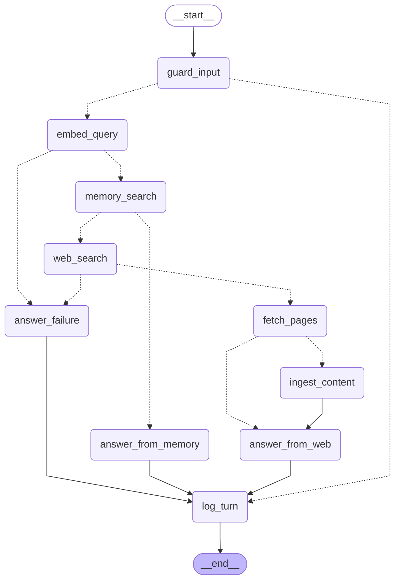

# Memory-First Web Agent

A GenAI agent that answers from **Redis vector memory first** (similarity ≥ 0.7, checked in
code — not by the model), falls back to **web search** on a miss, ingests what it finds for
future reuse, and returns **grounded answers with source URLs**.

> **Zero keys needed:** `make test` (fully offline) and `uv run python scripts/eval_lifecycle.py --mock`
> (needs a local `redis:8.2` — run `make redis-up` first). CI runs these among its lint / test / eval steps.
> **One key** (`OPENAI_API_KEY`) **+ Docker** for the live demo; `TAVILY_API_KEY` optional (keyless DuckDuckGo fallback).
>
> Quickstart: clone -> install uv -> `make setup` (uv sync + .env) -> `make redis-up` -> `make run`.

## Quickstart

Five commands from clone to a live miss→hit (needs `OPENAI_API_KEY` + Docker):

```bash
git clone <repo> && cd memory-first-agent
curl -LsSf https://astral.sh/uv/install.sh | sh   # install uv
make setup       # uv sync + create .env from .env.example (add OPENAI_API_KEY)
make redis-up    # docker compose up -d --wait (redis:8.2 + RedisInsight at http://localhost:5540)
make run         # chat REPL — ask a question twice: MISS then HIT
```

Other targets: `make ask Q="..."`, `make analytics`, `make wipe` (runs the `wipe-memory`
CLI subcommand — the Make target name differs from the CLI command name), `make test`,
`make test-integration`, `make lint`, `make demo`.

Inside `chat`, a live status line narrates each step and the decision it took (checking
memory → found it, or off to the web to read N pages), then the hit/miss banner and answer.
Type `/help` for the commands, `/clear` to forget the current conversation, and `exit` /
`quit` / Ctrl-D to leave; Ctrl-C while it is answering cancels that turn and drops you back
to the prompt (a real SIGINT arrives as an `asyncio.CancelledError` under the async runner,
so both are caught). All of this chrome is written to stderr on a real terminal only, so
`chat`'s stdout stays pipe-clean.

**Zero-key path** (matches CI, no API keys / no internet): `make test` (also needs no Redis) and
`uv run python scripts/eval_lifecycle.py --mock` (needs a local `redis:8.2` — `make redis-up`).

`make test` runs 400 keyless tests (408 total with the redis-backed integration/e2e set): unit
tests plus a 230-scenario BDD layer (pytest-bdd) with one feature file per module. Every one of
the 150 module-level functions and class methods is pinned by a `# covers:` declaration in the
feature files, enforced bidirectionally by a traceability gate — index and matrix in
[`docs/BDD.md`](docs/BDD.md).

**No uv?** `pip install -e ".[dev]"` inside a Python 3.12 venv works as a fallback
(uv + the committed `uv.lock` is the reproducible path).

## Why this is deliberately not a ReAct / tool-calling agent

The memory-first hit/miss decision is a **deterministic threshold branch in code** — a pure
router over graph state (`similarity >= SIMILARITY_THRESHOLD`), never an LLM judgment or a
tool-choice step. That is what keeps "memory-first" *verifiable* and the hit/miss turn log
*reliable*: the route is a property of the code, not of a model's mood. Parallelism lives
*inside* the `fetch_pages` node (`asyncio.gather` + a bounded semaphore), not as graph
fan-out, so the graph stays a single, auditable, per-turn-stateless `StateGraph`.

## Architecture

Auto-generated from the compiled LangGraph graph by `scripts/render_graph.py` (keyless;
re-running reproduces byte-identical output). Ten nodes; the L1 guard is the entry point.

<!-- BEGIN graph -->



<!-- END graph -->

## Turn log & analytics

Every turn appends one JSON record to `logs/turns.jsonl` (route, similarity, sources,
latencies, token usage, a whole-turn `cost_usd` priced from the documented per-model table,
query classification). `memagent analytics` renders hit-rate, topic/question-type, and
token-cost tables over it (`--json` for machines); `logs/turns.sample.jsonl` ships as a
record-format reference — on a fresh clone `analytics` reports no turns until you run
`ask`/`chat`. Cost covers the tracked LLM surfaces (answer / classifier / summaries);
unpriced models — including the $0 GitHub Models dev aliases — honestly report `0` rather
than a guess.

The turn log is directly DuckDB-queryable:

```
duckdb -c "SELECT route, count(*) FROM read_json_auto('logs/turns.jsonl') GROUP BY route"
```

JSONL stays the single source of truth — there is no Redis mirror of turn records.

### Optional LangSmith tracing

Tracing is **off by default**, so the default posture stays zero-egress. Opting in mirrors
every turn to [LangSmith](https://smith.langchain.com) as one `memagent` trace: a child span
per graph node (`guard_input → embed_query → memory_search → …`), every router decision, and
the individual LLM calls (the shared OpenAI transport is wrapped only when tracing is on).
Enable it in `.env`:

```
LANGSMITH_TRACING=true
LANGSMITH_API_KEY=lsv2_...
LANGSMITH_PROJECT=memory-first-web-agent   # optional — this is the default
```

The same per-turn `cost_usd` written to the JSONL record also lands on the trace — on the
`log_turn` span's outputs and the root run's final state — so the cost story reads
identically in both sinks.

`logs/turns.jsonl` remains the source of truth either way (keyless, offline,
DuckDB-queryable); LangSmith adds an interactive span viewer on top. Trade-off, stated
plainly: with tracing on, turn inputs and outputs (queries, fetched page content) are
uploaded to LangSmith's cloud — leave it off to keep everything on-machine. The keyless
test suite pins `LANGSMITH_TRACING=false`, so `make test` and CI never upload a trace.

## Security & reliability

Full threat model in [`docs/threat_model.md`](docs/threat_model.md). Five threats, defended by
three guardrail layers (L1 input screen, L2 instruction/data separation, L3
sanitize-before-store) plus an output defence and a fetch-side SSRF guard:

| ID | Threat | Mitigation |
|---|---|---|
| T1 | Direct injection in the user query | L1 input screen + L2 prompt hardening |
| T2 | Indirect injection inside fetched pages | L2 data/instruction separation + L3 sanitizer |
| T3 | **Memory poisoning** — injected content stored in Redis, replayed as trusted context on future hits | **L3 sanitize-before-store + persisted `sanitizer_flags` provenance** (the highest-value defense: anything surviving ingestion becomes "trusted memory" forever) |
| T4 | Exfil/unsafe output (attacker URLs, tracker images) | prompt rule "cite only provenance URLs" + markdown-image strip on output |
| T5 | SSRF via fetched URLs — a page redirecting to cloud-metadata / loopback / internal services | fetch-side guard in `web/fetch.py`: drop non-http(s) and private-IP-literal URLs, follow redirects manually with `_is_safe_fetch_target` re-checked on every hop, and reject hosts that DNS-resolve to a private/loopback/link-local address |

Reliability: every upstream dependency has a single-owner retry policy
(`utils/reliability.py`, tenacity) with typed failures; every failure mode has a designed
degradation outcome (web-only on Redis down, snippets-only when all fetches fail, a clean
`failed` apology when search/LLM/embeddings are down), and the turn is always logged exactly
once — never a traceback. No jailbreak-proof claims: the layers are "basic but real".

## Calibration & limitations

Stated honestly, each with its named production upgrade:

- **0.70 similarity threshold.** `SIMILARITY_THRESHOLD=0.7` is calibrated for
  `text-embedding-3-small`; the boundary is inclusive (`similarity = 1 − vector_distance`,
  the single conversion site). It is a chosen constant validated by mechanism and boundary
  tests (miss→store→hit routing plus inclusive-boundary value checks), not by an empirical
  semantic-calibration gate over a labelled paraphrase/non-match corpus — that side rests on
  hand-observed dev-tier figures. Changing `EMBEDDING_MODEL` changes what 0.70 *means* —
  re-tune `SIMILARITY_THRESHOLD` and run `make wipe` to rebuild the index for the new geometry.
- **TTL is a coarse staleness policy, not a limitation.** `MEMORY_TTL_SECONDS=604800` (7 days)
  bounds how long a stored page is reused. The production upgrade is ETag / Last-Modified
  conditional revalidation (re-fetch only when the source changed) rather than a blunt clock.
- **robots.txt is not consulted.** A known limitation for a single-user take-home; the
  production fix is a robots.txt fetch + cache honored before each page GET.
- **Why fetch + markdown stay in-house.** Fetching and markdown extraction are the two steps
  the assignment explicitly grades, so they are not outsourced to a one-shot Jina/Firecrawl
  call: local `trafilatura` wins on extraction quality and needs no second API key.
- Out of scope (deliberate): ML injection classifiers, DLP/PII redaction, URL reputation,
  auth/rate limiting — see `docs/threat_model.md`.

## Paraphrase behaviour (worked example)

Memory-first matching is embedding-similarity, so recall depends on how the re-ask is phrased:

- **Verbatim re-ask → HIT.** "How does Redis 8 vector search work?" asked twice → turn 2 is a
  `memory_hit` (`sim ≈ 0.74` in the cited transcript, ~0.04 above the 0.70 boundary), answered
  from memory with no web call. It is not a 1.0 self-match: the query is never
  embedded-and-stored, so the re-ask matches against the stored page's summary + chunks (the
  demo transcript shows the live figure).
- **Paraphrase → depends.** "Explain how vectors are searched in Redis" embeds *near* the
  original but may fall just below 0.70 and miss — then it searches the web and ingests, so the
  *next* phrasing in that neighbourhood hits.
- **Why it improves over time.** Each page is stored with a per-page *summary* doc embedded at
  "question altitude" alongside its chunks, which raises hit rates for paraphrases that share
  intent but not wording. Lowering `SIMILARITY_THRESHOLD` trades precision for recall.

## Design decisions

See [`DECISIONS.md`](DECISIONS.md) for the standing locked-decision / anti-churn record, and
[`MODEL_CHOICES.md`](MODEL_CHOICES.md) for the two-LLM choice / cost / quality story.

## Demo transcript

A captured miss→ingest→hit session lives in
[`docs/demo_transcript.md`](docs/demo_transcript.md) (re-capture on a production key via
`python scripts/capture_demo.py`). The same behaviour is proven keylessly in CI by
`tests/e2e/test_lifecycle.py`, `scripts/eval_lifecycle.py --mock`, and the per-route scenarios
in `tests/bdd/features/00_main_functionality.feature` (one BDD scenario per route, including
the degraded and blocked paths).

## AI assistance

Built with AI assistance under a complete-disclosure rule — see [`AI_USAGE.md`](AI_USAGE.md)
(the complete instruction record) and the per-milestone prompt logs in `docs/ai_prompts/`.

## License

MIT — see `LICENSE`.
