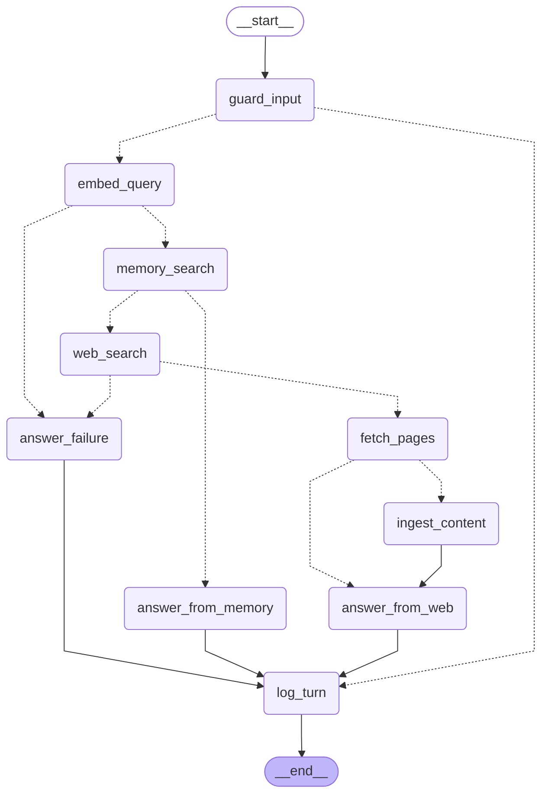

# Architecture

<!-- BEGIN graph -->

```mermaid
---
config:
  flowchart:
    curve: linear
---
graph TD;
	__start__([<p>__start__</p>]):::first
	guard_input(guard_input)
	embed_query(embed_query)
	memory_search(memory_search)
	answer_from_memory(answer_from_memory)
	web_search(web_search)
	fetch_pages(fetch_pages)
	ingest_content(ingest_content)
	answer_from_web(answer_from_web)
	answer_failure(answer_failure)
	log_turn(log_turn)
	__end__([<p>__end__</p>]):::last
	__start__ --> guard_input;
	answer_failure --> log_turn;
	answer_from_memory --> log_turn;
	answer_from_web --> log_turn;
	embed_query -.-> answer_failure;
	embed_query -.-> memory_search;
	fetch_pages -.-> answer_from_web;
	fetch_pages -.-> ingest_content;
	guard_input -.-> embed_query;
	guard_input -.-> log_turn;
	ingest_content --> answer_from_web;
	memory_search -.-> answer_from_memory;
	memory_search -.-> web_search;
	web_search -.-> answer_failure;
	web_search -.-> fetch_pages;
	log_turn --> __end__;
	classDef default fill:#f2f0ff,line-height:1.2
	classDef first fill-opacity:0
	classDef last fill:#bfb6fc
```

<!-- END graph -->
