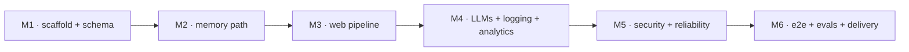

# Milestone Specs — Memory-First Web Agent

## Purpose

This directory holds six milestone specifications derived from [`../PLAN.md`](../PLAN.md). Each file
expands one milestone of the plan into a self-contained, buildable unit: goal, scope, functional
requirements, technical specification, BDD acceptance scenarios, task breakdown, Definition of Done,
and a GitHub Spec Kit mapping. The specs are a working restatement of the plan for execution — they
do **not** introduce new decisions. **`PLAN.md` is authoritative; on any conflict between a spec and
the plan, the plan wins** and the spec is corrected to match, never the reverse.

## Milestone index

| File | Title | Est. | Depends on | Demoable outcome (PLAN §13) |
|---|---|---|---|---|
| [milestone-1-scaffold-and-memory-schema.md](milestone-1-scaffold-and-memory-schema.md) | Repo scaffold, toolchain, Redis index schema | 3–4 h | — (Docker, uv/pip, Python 3.12 only) | `make setup && make redis-up && memagent wipe-memory`; RedisInsight shows the empty `web_memory` index |
| [milestone-2-memory-path.md](milestone-2-memory-path.md) | Memory path — embeddings, store, KNN, threshold routing, graph skeleton | 4–5 h | M1 | seeded doc → `memagent ask` → `[MEMORY HIT sim=0.87]` + stored metadata |
| [milestone-3-web-pipeline.md](milestone-3-web-pipeline.md) | Web pipeline — search, fetch, markdown, summarize, ingest | 4–5 h | M1, M2 | full miss→ingest→hit lifecycle live; first demo transcript |
| [milestone-4-llms-logging-analytics.md](milestone-4-llms-logging-analytics.md) | Two LLM clients finalized, turn log, classifier, analytics CLI, REPL | 3–4 h | M1, M2, M3 | all 4 subcommands work; `analytics` table over real turns |
| [milestone-5-security-reliability.md](milestone-5-security-reliability.md) | Guardrails (L1/L2/L3) and reliability (retries, degradation) | 3–4 h | M1, M2, M3, M4 | injection blocked; Redis killed mid-session → clean degraded answer |
| [milestone-6-e2e-evals-delivery.md](milestone-6-e2e-evals-delivery.md) | Integration/e2e tests, eval harnesses, CI green, docs, v1.0 | 4–5 h | M1–M5 | evaluator runs everything in 5 commands |

Core total ≈ 20–26 h. Every milestone ends in a submittable state.

## Dependency graph



The chain is strictly linear per the spec headers. M4 and M5 are **not** independent: M5 fills seams
that M4 finalizes (the two LLM clients, the real `log_turn` node, the classifier), so M5's `Depends on`
lists M4. M2 and M3 deliberately leave typed stubs (miss branch, pass-through sanitizer, thin client
wrapper) so later milestones drop in without touching pipeline code, but each still builds on the one
before it.

## How to use with GitHub Spec Kit

Recommended flow: **treat each milestone as one Spec Kit feature.**

1. Initialize once: `specify init` in a fresh repo (or reuse an existing spec-kit project). This is a
   one-time step, not per milestone.
2. For each milestone, in order (M1 → M6), feed the file's **§11 Spec Kit mapping** into the Spec Kit
   commands. The §11 mapping in every file names exactly which sections go where:
   - `/specify` ← §1 Goal & context, §2 Scope, §5 Functional requirements, §7 BDD scenarios (the *what* + acceptance).
   - `/plan` ← §3 Prerequisites & interfaces consumed, §4 Interfaces provided, §6 Technical specification, §10 Risks & gotchas (the *how* + seams).
   - `/tasks` ← §8 Task breakdown (`T-Mx-NN` with `[P]` markers + FR links) and §9 Definition of Done (verify commands).
   - `/implement` ← execute the generated `tasks.md`; the §9 DoD is the acceptance gate that closes the feature.
3. Do not start milestone N+1 until milestone N's Definition of Done is green — the `Depends on`
   column above is a hard ordering, not a suggestion.

### Suggested `constitution.md`

Distilled from `PLAN.md`; paste into the Spec Kit constitution so every `/plan` and `/implement`
inherits these non-negotiables:

```markdown
# Constitution — Memory-First Web Agent

1. Memory-first routing is CODE, not model judgment. The hit/miss decision is a deterministic
   threshold branch in the graph (a pure router function), never an LLM call.
2. Similarity = 1 − vector_distance. A hit is `similarity >= 0.70` (INCLUSIVE). This conversion
   lives at exactly ONE site (`memory/store.py`) and is unit-tested at the 0.70 boundary.
3. One retry owner. `tenacity` (`utils/reliability.py`) is the single source of backoff; the OpenAI
   SDK is constructed with `max_retries=0`. No ad-hoc retry loops anywhere.
4. JSONL is the single source of truth for turns (`logs/turns.jsonl`, one `TurnRecord` per turn,
   including blocked/degraded turns). No Redis turn-log mirror.
5. Sanitize before store. Web content is neutralized ONCE at ingestion (L3) and stays flagged with
   provenance forever, so a poisoned page can never replay as trusted memory on a later hit.
6. No scope beyond PLAN.md. Build only what a milestone's spec asks; honor the anti-churn list.
7. AI_USAGE is appended per milestone, never written retroactively. Every milestone's DoD includes
   a dated `docs/ai_prompts/milestone-N.md` entry referenced from `AI_USAGE.md`.
```

## Global rules (apply to every milestone)

- **`PLAN.md` wins.** Any spec detail that contradicts the plan is a spec bug; fix the spec, not the plan.
- **Every DoD includes the AI_USAGE append.** A milestone is not done until its dated prompt log lands
  in `docs/ai_prompts/` and `AI_USAGE.md` references it — appended, never backfilled (PLAN §11, §15.5).
- **Anti-churn list (verbatim, PLAN §15.3):** *"the feasibility review cut weak-memory salvage,
  canary/output-guard, Redis log mirror, coverage gate, and ~half the test files; do not silently
  re-add them."* Standing cuts enumerated across the specs, none to be "helpfully" re-added:
  - Redis turn-log mirror / JSON-ZSET mirror + `--from-file` (JSONL is the single source of truth)
  - Canary token and output URL-defang allowlist (stretch only)
  - `GUARD_LLM_CHECK` gray-zone LLM classifier (stretch only)
  - 0.50 weak-memory salvage route and 2-hit chunk-drop policy (L3 neutralizes, does not delete)
  - Coverage gate (CI emits a coverage report only, no threshold)
  - Token streaming (`stream_mode="messages"`) — the REPL streams graph *updates*, not tokens
  - ML injection classifiers, DLP/PII redaction, URL reputation, auth/rate limiting, jailbreak-proof
    claims (production upgrade path, out of scope, stated in README)

## Verification (one line per milestone)

Each is drawn from the milestone's §9 Definition of Done / demoable outcome; run from repo root.

- **M1:** `make setup && make redis-up && uv run memagent wipe-memory` (exits 0; RedisInsight at `http://localhost:5540` shows the empty `web_memory` index).
- **M2:** `uv run pytest tests/unit/test_routing.py tests/unit/test_similarity.py tests/unit/test_chunker.py -q` (0.70-inclusive boundary + `distance_to_similarity(0.30)==0.70` pass), then a seeded `memagent ask` prints `[MEMORY HIT sim=0.XX]`.
- **M3:** `uv run memagent wipe-memory && uv run memagent ask "<novel Q>"` prints a MISS with web Sources; re-asking prints `[MEMORY HIT sim=0.9x]` and makes **no** web call.
- **M4:** `uv run ruff check . && make test`, then `uv run memagent analytics` renders a real hit-rate + topic table over turns (all four subcommands work).
- **M5:** `WAIT_CAP_SCALE=0 uv run pytest tests/unit/test_guardrails.py tests/unit/test_sanitizer.py tests/unit/test_search_retry.py tests/unit/test_fetch_retry.py -q` (injection blocked; retry call-counts 3/1/3 search, 2/1 fetch).
- **M6:** `uv run pytest -m "not integration and not e2e"` (keyless), then `python scripts/eval_lifecycle.py --mock; echo $?` returns `0`.
